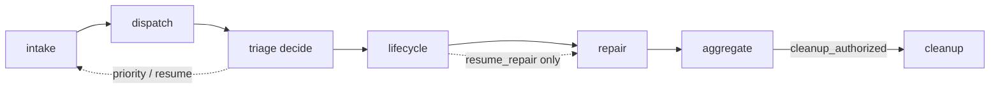

# Lokay process map (scaffold)

Canonical map of **what runs, in what order, who owns which fact, and which
decision table applies**. This is a contract for sequential process work — not a
promise that every path is fully correct or complete.

Related:

- runtime packaging: [`auto-worker.md`](auto-worker.md)
- GitHub ↔ Kanban facts: [`github-kanban-mapping.md`](github-kanban-mapping.md)
- effector inventory: [`effector-catalog.md`](effector-catalog.md)
- formal handoff SM only: [`../dispatch.machine.ts`](../dispatch.machine.ts)

Status legend used below:

| Status | Meaning |
| --- | --- |
| `live` | Present in `fala-package.toml` / steps and intended production path |
| `diag` | Manual CLI only; not scheduled |
| `formal` | Modeled in TLA/precheck, not the full runtime |
| `scaffold` | Named contract for later fix/implement; may only partially exist |
| `gap` | Known missing or inconsistent behavior to fix later |

---

## 1. One sentence

One scheduled tick (`lokay-tick-all` → Fala path `auto_worker`) composes four
work lanes, one join, and one gated cleanup lane. GitHub owns public issue/PR
facts; Hermes Kanban owns agent work items; local FS/git owns leftovers; Fala
owns process journal; OMP only runs when a gate authorizes it.

There is **no single runtime state machine** for the whole lifecycle. Runtime is
composed decision tables + evidence. The only formal SM today is dispatch
handoff (`dispatch.machine.ts`).

---

## 2. Ownership (who mutates what)

| Domain | Source of truth | Who may mutate | Notes |
| --- | --- | --- | --- |
| Issue/PR existence, labels, checks, merge, close | GitHub | `gh` via allowlisted steps | Never invent GitHub state from Kanban |
| Agent work ownership / decomposition | Hermes Kanban | intake / dispatch / triage / cleanup steps | Titles/markers are idempotency keys |
| Claim file, worktree, local branch leftovers | Local FS + git | claim / dispatch / repair / lifecycle / cleanup | Cleanup is local-only for branches |
| Process run / conduction journal | Fala SQLite | package host | Correlate logs ↔ run IDs |
| Scheduling | launchd | human promotion of candidate | Sole mutator job: `lokay-tick-all` |
| Code changes on branch | worktree | OMP when authorized | Never on pending checks for same head |

Lokay is an **adapter/orchestrator**, not a second SoT.

---

## 3. Triggers and modes

| Trigger | Path | Mutates? | Role |
| --- | --- | --- | --- |
| launchd / `lokay-tick-all` | `auto_worker` | only when live + guards | sole scheduled mutator |
| `lokay-tick-intake` | `issue_intake` | if live | `diag` |
| `lokay-tick-dispatch` | `issue_to_pr` | if live | `diag` |
| `lokay-tick-triage` | `pr_triage` | if live | `diag` |
| `lokay-tick-cleanup` | `cleanup` | if live | `diag` |
| dry-run (default) | any | no | plan / authorize without side effects |

Legacy shell intake/dispatch/triage/cleanup, webhooks, backfill, and extra
scheduled jobs are removed and must not return as operational paths.

---

## 4. `auto_worker` shape (corrected)

Not “six independent lanes”. One composed graph:

```text
intake_* (≈47)               # pre-intake triage → priority gate → direction → claim → Kanban
  ↘ early triage decide     # intake priority may skip when existing-PR repair wins
dispatch_* (≈42)            # select Kanban → handoff `[fix-pr]` → OMP → PR
  → triage_decide_*         # select PR → decide merge/comment/repair/skip
  → lifecycle_* (≈5)        # thin reconcile after PR decide, before repair
  → repair_* (continuation) # head-bound OMP only when lifecycle allows resume_repair
  → aggregate_lane_results  # join + cleanup authorization
  → cleanup_* (≈29)         # only when aggregate authorizes identity
```

Effector counts are from package inventory; treat as approximate as paths evolve.
Package wiring places lifecycle atoms after `triage_decide_triage_action` and before
repair (`lifecycle_decide_lifecycle_transition` conducts into
`triage_decide_repair_attempt`). Early PR triage also interleaves intake priority
(`intake_decide_issue_priority` conduction includes `triage_decide_triage_action`).

### 4.1 Lanes

| Lane | Prefix / atom | Path source | Responsibility | Status |
| --- | --- | --- | --- | --- |
| Intake | `intake_*` | `issue_intake` | pre-intake triage → direction → claim → Kanban `[issue]` | `live` |
| Dispatch | `dispatch_*` | `issue_to_pr` | select Kanban → handoff `[fix-pr]` → OMP → PR | `live` |
| PR triage | `triage_*` | `pr_triage` | select PR → decide merge/comment/repair/skip → apply | `live` |
| Lifecycle | `lifecycle_*` | subset of reconcile | read GH+local → decide transition → optional orphan release | `live` (thin; mid-triage) |
| Aggregate | `aggregate_lane_results` | orchestration | join receipts, `worked`/`idle`/`pending`, cleanup auth | `live` |
| Cleanup | `cleanup_*` | `cleanup` | local worktree/branch/claim cleanup + maintenance task | `live` (gated) |

### 4.2 Paths outside the scheduled composition

| Path | Role | Status |
| --- | --- | --- |
| `cleanup_reconcile` | no-target / standalone reconciliation diagnostics | `live` path, **not** an `auto_worker` lane |
| `dispatch.machine.ts` | formal intake→fix→PR handoff invariants | `formal` only |

### 4.3 Hard couplings (not independent)

These edges are intentional; do not “simplify away”:

1. **Intake priority gate** — if existing-PR repair has priority, intake skips (`decide_issue_priority` → `decide_issue_action` skip). Intake/dispatch may continue after early triage decide when priority does not block.
2. **Triage decide → lifecycle → repair** — lifecycle runs after PR decide and gates repair; only `resume_repair` continues into OMP authorization.
3. **Aggregate → cleanup** — cleanup runs only with verified `cleanup_authorized` + complete `cleanup_identity` from lane receipts.
4. **Head-bound repair** — one OMP repair attempt per current PR head; pending checks wait; no second invoke for same head unless verified recovery re-authorizes.




---

## 5. Conceptual multi-tick lifecycle (not a runtime SM)

Use this only as a human map of **progress over many ticks**. Each box is
evidence in GitHub/Kanban/local, advanced by one lane decision — not a stored
Lokay state enum.

```text
open issue
  → pre-intake classified (ready | needs_feedback | duplicate | out_of_scope)
  → labels / feedback / optional authorized close
  → eligible + selected
  → direction accept | reject_comment | skip
  → claim + assign + in_progress
  → Kanban [issue]
  → handoff [fix-pr]          # formal SM covers this handoff only
  → worktree + OMP implement
  → PR open (ai/fix/*)
  → triage: merge | comment_block | repair | skip
  → (optional) one repair OMP @ exact head
  → merge + close linked issue + merge receipt
  → lifecycle finalize_* / ready_for_merge / wait_* / resume_repair
  → cleanup local leftovers + cleanup receipt
```

Normal non-progress terminals (healthy or waiting, not “broken map”):

- empty queue / `no_candidate` / `not_selected`
- `claim_busy`
- `pr_priority_repair_required` (intake skipped)
- `checks_pending` / `wait_pending_checks`
- `already_repaired` / `already_absent`
- dry-run / executor-disabled / not-live gates

### 5.1 Formal handoff only (`dispatch.machine.ts`)

Per issue vars: `intakeExists`, `fixExists`, `selectedKind ∈ {none,intake,fix}`, `prOpen`.

Actions: `createIntakeTask` → `selectIntakeTask` → `handoffToFixTask` →
`selectFixTask` → `openPrFromFixTask`.

Invariants: fix supersedes intake selection; PR only from selected fix.

Everything after PR open (triage/repair/merge/cleanup) is **outside** this SM.

---

## 6. Decision tables (contracts)

### 6.1 Pre-intake classification

Source: `classify_triage_issue`.

| classification | meaning | typical mutation path |
| --- | --- | --- |
| `ready` | actionable | `add_ready` (`ai:ready`) |
| `needs_feedback` | ask human | feedback label + question |
| `ambiguous` | unsafe classify | **mapped to** `needs_feedback` + question |
| `duplicate` | points at canonical | feedback → optional authorized close |
| `out_of_scope` | not for agent | `action=close` when `auto_close_out_of_scope` (default on); stamps class label then closes |
| `mixed` | separable ready and clarification-needed concerns | P15 creates one labeled child per portion, then verified split authorizes parent close |

**Not a classification:** `frozen`. Frozen is **label precedence** in
`decide_triage_mutation`: if frozen present, remove ready or noop — frozen wins
over classifier output.

Close still requires close-authorization receipts. For `out_of_scope`, durable
classification + `auto_close_out_of_scope` authorizes close (no goal / no
independent label evidence required). Residual OPEN + `ai:out-of-scope` re-enters
until close is verified.

### 6.2 Direction (`decide_issue_action`)

First match after empty/noop checks (matches `issue_direction.py`):

1. upstream priority block from `decide_issue_priority` → `skip` (repair priority)
2. triage precedence action on selected issue (if any)
3. reject labels (`ai:out-of-scope` / `wontfix` / `invalid` / configured)
4. empty title → `reject_comment`
5. deny keywords in title/body
6. require keywords when configured (must hit ≥1)
7. repo_goal token overlap when goal configured
8. else `accept`

Actions: `accept | reject_comment | skip`.

Accept still does not skip claim/Kanban atoms; those run only when action and
gates authorize.

### 6.3 PR triage (`decide_triage_action`)

Order is eligibility first, then readiness:

**Eligibility → `skip`**

- not `OPEN`
- draft
- head not under branch prefix (`ai/fix` default)
- wrong base branch
- missing author / external author when `require_owner`
- `ai:blocked` label

**Readiness**

| condition | action | reason |
| --- | --- | --- |
| checks not green | `repair` | `checks_not_green` |
| missing test evidence | `repair` | `missing_test_evidence` |
| merge conflict (`CONFLICTING`/`DIRTY`) | `repair` | `merge_conflict` |
| other not mergeable | `skip` | `not_mergeable` |
| approval required and not approved | `comment_block` | `approval_required` |
| automerge on + ready | `merge` | `ready` |
| automerge off | `comment_block` | `automerge_disabled` |

### 6.4 Repair attempt (`decide_repair_attempt`)

First-match order (matches `decide_repair_attempt` + `_repair_lifecycle_gate`):

| condition | decision | authorize |
| --- | --- | --- |
| triage decision gate blocks | wait / terminal from gate | false |
| lifecycle present and `noop` | wait (`lifecycle` reason) | false |
| lifecycle failed / cancelled / timed_out | terminal upstream | false |
| lifecycle outcome not `resume_repair` (`wait_pending_checks`, `finalize_*`, `ready_for_merge`) | wait (outcome) | false |
| lifecycle outcome invalid for repair | terminal `invalid_repair_lifecycle` | false |
| executor off / not live / dry-run | `wait` | false |
| completed receipt for exact head | `already_repaired` | false |
| prior state + verified recovery (same head) | `invoke` | true |
| prior status pending/waiting/running/authorized | `wait` | false |
| prior status reserved/repaired/succeeded/completed/invoked/failed/already_repaired **or** `attempted` | `already_repaired` | false |
| checks pending | `wait` | false |
| check failures **or** triage `missing_test_evidence` **or** triage `merge_conflict` | `invoke` | true |
| checks passed and no repair reason above | `already_repaired` | false |

Invariant: **at most one OMP invoke per current head** unless verified recovery
explicitly re-authorizes that same attempt identity. Green checks alone do not
block invoke when triage reason is `missing_test_evidence` or `merge_conflict`.

### 6.5 Lifecycle (`decide_lifecycle_transition`)

First-match order (matches `decide_lifecycle_transition`):

| evidence | outcome |
| --- | --- |
| remote absent + local orphan claim | `release_orphan` |
| remote absent + no local ownership | `already_absent` |
| remote absent + ambiguous local | terminal conflict |
| identity / linked-issue / open-PR conflicts | terminal conflict |
| PR `MERGED` | `finalize_merged` |
| PR `CLOSED` | `finalize_closed` |
| non-OPEN state | terminal conflict |
| checks pending | `wait_pending_checks` |
| missing test evidence + triage repair + checks passed | `resume_repair` |
| checks failed | `resume_repair` |
| checks passed | `ready_for_merge` |
| open PR with no actionable check state | terminal conflict |

Lifecycle in `auto_worker` is intentionally thin: decide + optional orphan
release, placed **between** PR decide and repair. Full no-target reconciliation
remains path `cleanup_reconcile`.


### 6.6 Aggregate (`aggregate_lane_results`)

- join lane tails: intake / dispatch / triage / lifecycle
- `worked` = issue-triage work **or** intake/dispatch selection **or** any `mutated=true`
- `pending` = lifecycle `wait_*` / pending/waiting status
- `idle` = no failures and not worked and not pending
- on success, may set `cleanup_authorized` + `cleanup_identity`

Empty-queue idle is **scheduler healthy**, not “agent resolved issues”.

---

## 7. Process inventory (unit of later work)

Work one row at a time. Do not expand a row into a second SoT.

| ID | Process | Primary files | Package path(s) | Status | Next work note |
| --- | --- | --- | --- | --- | --- |
| P0 | Scheduled composition / tick entry | `tick_all.py`, `flows/runtime.py`, `fala-package.toml` `auto_worker` | `auto_worker` | `live` | Keep sole mutator invariant |
| P1 | Open-issue poll + eligibility | `steps/poll.py` | `issue_intake` | `live` | |
| P2 | Pre-intake triage (classify/mutate/close/receipts) | `issue_triage_*.py` | `issue_intake` | `live` | |
| P3 | Direction + reject comment | `issue_direction.py` | `issue_intake` | `live` | Keep priority + require-keywords order |
| P4 | Claim + assign + labels | `claim.py` | `issue_intake` | `live` | |
| P5 | Kanban `[issue]` ensure | `kanban_intake.py` | `issue_intake` | `live` | |
| P6 | Dispatch handoff + implement + PR | `issue_to_pr.py`, adapters | `issue_to_pr` | `live` | Formal SM covers handoff only |
| P7 | PR triage decide + merge/comment | `triage.py` | `pr_triage` | `live` | |
| P8 | Repair (head-bound) | `repair.py` | `pr_triage` | `live` | Highest complexity; keep receipts/reservations |
| P9 | Lifecycle thin reconcile | `cleanup_reconcile.py` (lifecycle atoms) | `auto_worker` lifecycle_* | `live` | Do not conflate with full cleanup |
| P10 | Aggregate / cleanup auth | `orchestration.py` | `auto_worker` | `live` | |
| P11 | Local cleanup + maintenance task | `cleanup.py` | `cleanup` | `live` | Gated by aggregate in auto_worker |
| P12 | Standalone no-target reconcile | `cleanup_reconcile.py` | `cleanup_reconcile` | `live`/`diag` | Not a sixth auto_worker lane |
| P13 | Full-lifecycle formal SM | — | — | `scaffold`/`gap` | Only if we later want TLA beyond handoff |
| P14 | Doc/package parity | `docs/auto-worker.md`, `docs/process-map.md`, package | — | `live` | path table matches package; composition + §6.4/§6.5 decision order match code |
| P15 | Mixed issue split | `issue_triage.py`, `issue_triage_mutations.py`, `issue_triage_receipts.py` | `issue_intake` | `live` | One idempotent child per validated portion; existing close atom owns parent close |

---

## 8. Suggested implementation order (later)

When fixing/implementing, prefer this order so contracts stay stable:

1. **P0 + this map** — composition and ownership stay true
2. **P2 decision/mutation parity** — frozen/ready/close receipts
3. **P3 priority + direction** — intake does not fight repair
4. **P6 handoff invariants** — align runtime with `dispatch.machine.ts`
5. **P7 triage order** — eligibility before readiness
6. **P8 repair head-binding** — no double OMP
7. **P9/P10/P11 cleanup auth chain** — no ungated local delete
8. **P14 docs** — make auto-worker path table match package
9. **P13** only if a real bug needs full-lifecycle formalization

Each process change should:

- name the process ID above
- preserve ownership table
- update this map if a decision table or coupling edge changes
- keep individual ticks diagnostic-only

---

## 9. Explicit non-goals (for this scaffold)

- Not implementing new effectors or package rewires in this document
- Not inventing a stored Lokay issue-state enum
- Not mirroring every Kanban status to GitHub
- Not force-push or remote branch deletion in cleanup
- Not treating dry-run success or idle ticks as issue resolution

---

## 10. Acceptance for “map is good enough to code against”

- [x] Lanes = 4 work + aggregate + cleanup; `cleanup_reconcile` separate
- [x] Frozen is label precedence, not classifier class
- [x] Ready ≠ auto-claim; direction and eligibility sit in between
- [x] Decision tables match current step entrypoints named above (incl. repair lifecycle gate + lifecycle first-match)
- [x] Hard couplings listed (triage decide → lifecycle → repair)
- [x] Process IDs ready for one-by-one work
- [x] auto-worker path table includes pre-intake triage + cleanup_reconcile
- [ ] Runtime/docs fully parity-checked after each process fix (ongoing)
